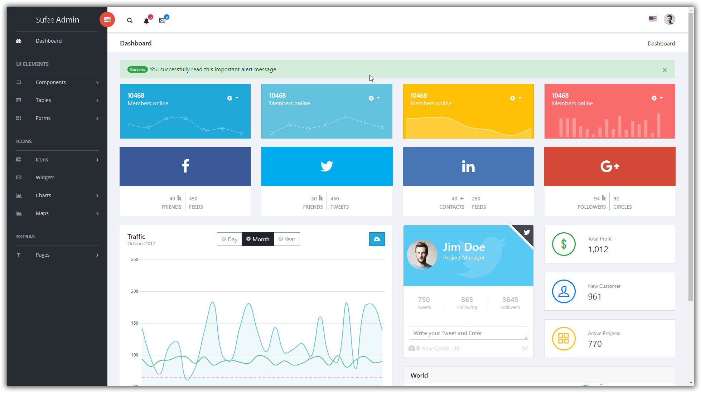

# Sufee HTML5 Admin Dashboard Template (for Flask!)
**Sufee** is a responsive Bootstrap 4 Admin Template. It provides you with a collection of ready to use code snippets and utilities, custom pages, a collection of applications and some useful widgets. Preview of this awesome admin template available here: https://colorlib.com/polygon/sufee/index.html

- project forked to setup to use in a Flask project.

# Preview

### Screenshot

### Demo Site: [Here](https://sufee-admin.devsetgo.com/)

### TOC
- [Built With](#built-with)
- [Changelog](#changelog)
- [Authors](#authors)
- [License](#license)

### Built With

- [Flask](http://flask.pocoo.org/)
- [Sass](http://sass-lang.com/)
- [Bootstrap](http://getbootstrap.com/)
- [Chart.js](http://www.chartjs.org/)
- [jQuery](https://jquery.com/)
- [Popper.js](https://popper.js.org/)
- [Chosen](https://harvesthq.github.io/chosen/)
- [dataTables](https://datatables.net/)
- [Flot Charts](http://www.flotcharts.org/)
- [gauge.js](http://bernii.github.io/gauge.js/)
- [Peity](http://benpickles.github.io/peity/)
- [Load Google Maps API](https://github.com/yuanqing/load-google-maps-api)
- [JQVMap](https://jqvmap.com/)
- [gmaps](https://hpneo.github.io/gmaps/)
- [Fontawesome](http://fontawesome.io/)

### Authors
- For Flask - [Mike Ryan](https://github.com/MikeRyan56)
- Original [Colorlib](https://colorlib.com)

### Changelog
#### V 1.2.0 - 6 October, 2018
- Dockerfile/Docker-Compose created -- docker pull mikeryan56/sufee-admin-flask
- running on Gunicorn
- Update of requirements.txt

#### V 1.1.0 - 6 October, 2018
- Conversion of all html pages to use Jinja2 templates.
- Fix of typos in original template
- Creation of basic layout for [Flask](http://flask.pocoo.org/)

#### V 1.0.0
Initial Release
### Authors
[Colorlib](https://colorlib.com)
### License

Sufee is licensed under The MIT License (MIT). Which means that you can use, copy, modify, merge, publish, distribute, sublicense, and/or sell copies of the final products. But you always need to state that Colorlib is the original author of this template.
